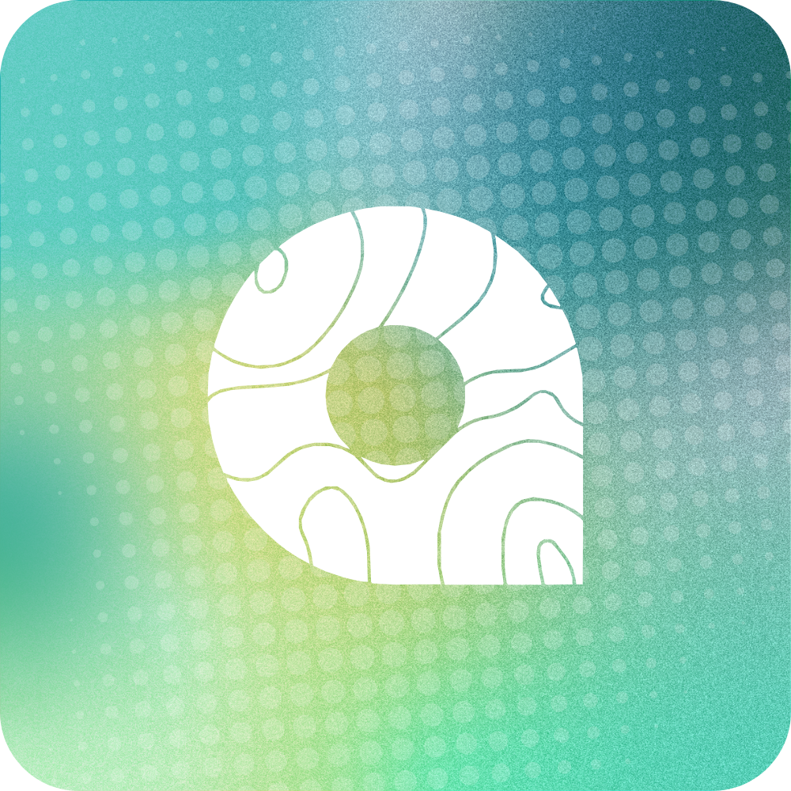

# MyWay 🗺️

**The ultimate group travel companion.** Real-time location sharing, group chats, waypoint planning, and invite management — all in one beautifully crafted Android app. Stop juggling Google Maps, Life360, and Messenger. MyWay does it all.

## 🛠 Language and Framework


100% Kotlin + Jetpack Compose (Material3), Google Maps via `maps-compose`, Firebase Auth. No Java, no XML layouts.

## 🚀 Getting Started

### Prerequisites
- Android Studio
- Android SDK 24+ (API level 24 is minimum; targeting API 36)
- Firebase account with a project initialized for Android

### Setup

1. **Clone and open in Android Studio**
   ```bash
   git clone https://github.com/JoshMango/NEW_MyWay
   cd NEW_MyWay
   ```

2. **Configure Firebase**
   - Create a Firebase project at [firebase.google.com](https://firebase.google.com).
   - Download `google-services.json` for your Android app and place it at `app/google-services.json`.
   - Enable **Authentication** (Email/Password, Google, GitHub) and **Firestore Database** (production mode) in the Firebase console.

3. **Add Google Maps and Place API key**
   - Create a `secrets.properties` file at the project root (it's gitignored):
     ```properties
     MAPS_API_KEY=YOUR_GOOGLE_MAPS_API_KEY_HERE
     ```
   - Get your key from [Google Cloud Console](https://console.cloud.google.com) and restrict it to your app's package name + debug SHA-1.

4. **Build and run**
   ```bash
   ./gradlew assembleDebug
   ./gradlew installDebug  # Requires connected device or emulator
   ```

## 📖 Project Structure

Everything is Kotlin + Jetpack Compose in one flat package — no Java, no XML layouts.

```
app/src/main/
├── java/com/usc/myway/
│   ├── LoginActivity.kt / RegisterActivity.kt   # Auth screens (Firebase)
│   ├── AuthComponents.kt                        # Shared auth composables
│   ├── MainActivity.kt                          # Map home screen (maps-compose)
│   ├── MapMarkers.kt                            # Pin/label rendering (MapMarkerManager)
│   ├── PlaceSheets.kt                           # Marker + landmark-detail bottom sheets
│   ├── Sidebar.kt / BottomCard.kt / SearchBar.kt # Map overlays (drawer, stats, search)
│   ├── MapPickerActivity.kt                     # Waypoint / address picker
│   ├── ShowSavedLocations.kt                    # Saved waypoints + collections (tabs)
│   ├── App.kt                                   # Application singleton, local data store
│   ├── Collection.kt                            # Collection model
│   └── ui/theme/Theme.kt                        # Material3 theme (MyWayTheme)
├── res/
│   ├── raw/map_dark.json                        # Google Maps night style
│   ├── drawable/, drawable-nodpi/               # Icons (Google, GitHub, launcher)
│   └── values/                                  # colors.xml, theme.xml, strings.xml
```
